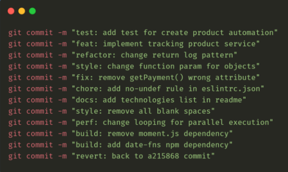

<h1 align="center">
	📄<br>Conventional Commits
 </h1>

<div align="center">

 [English](https://github.com/nandajfa/conventional_commits) | [Português](https://github.com/nandajfa/padroes-de-commits)

  [](https://github.com/nandajfa/conventional_commits/blob/main/LICENSE)

</div>
---

  

---

### 🗣️ About

It is important to use git commit properly. Having a consistent, standardized language helps everyone involved in the project understand what changes occurred and which contexts were affected.

Commits are points in the timeline of a project. When documented properly they show us who made a change, when, in what context and what kind of change was made. With this in mind, let's get to know the Conventional Commits Pattern.

### Index

You're sections headers will be used to reference location of destination.

- [What it is?  💡](#what-it-is)
- [How To Use  📝](#how-to-use)
- [What are the commit types? ⬇️ ](#what-are-the-commit-types)
- [Recommendations ☑️](#recommendations)
- [Emoji patterns 📍](#emoji-patterns)
- [References 🔗](#references)
- [Author Info  ✒️](#author)

---

###  What it is?

Conventional Commits is a simple commit messaging convention that follows a set of rules and helps projects to have an explicit and well-structured commit history.

There are several benefits in using this kind of convention, such as being able to automate the creation of CHNGELOGs, facilitate the entry of new Devs into the project, as well as being able to generate reports and understand where the project's hours are being concentrated (on code refactoring, feature creation, style changes, development environment, among others).

---

###  How to use?

The rules are very simple, as shown below we have a commit type (type), the commit scope and the commit subject/message (subject), but further on I will detail each one.

```bash
<type>[optional scope]: <description>

[optional body]

[optional footer(s)]
```

Example:

```
git commit -m "refactor: changed the markup"
git commit -m "refactor(web/mobile): change createUser() logs"
```
<br>[🔝 Back To The Top](#conventional-commits-) <br>

---

###  What are the commit types? 

The type is responsible for telling us what type of change or iteration is being made, from the convention rules, we have the following types:

- `test`- indicates any kind of creation or change of test code. Example: Creating unit tests.

- `feat` - indicates the development of a new feature to the project. Example: Adding a service, functionality, endpoint, etc.

- `refactor` - used when there is a code refactoring that does not have any kind of impact on the business logic/rules of the system. Example: Code changes after a code review.

- `style` - employed when there are formatting and style changes in the code that do not alter the system in any way. Example: Change style-guide, change lint convention, fix indentations, remove whitespace, remove comments, etc.

- `fix` - used when fixing errors that are generating bugs in the system.
Example: Apply handling to a function that is not behaving as expected and returning an error.

- `chore` - indicates design changes that do not affect the system or test files. These are development changes. Example: Change eslint rules, add prettier, add more file extensions to .gitignore.

- `docs` -  used when there are changes in the project documentation.
Example: adding information in the API documentation, changing the README, etc.

- `build` - used to indicate changes that affect the build process of the project or external dependencies.
Example: Gulp, add/remove npm dependencies, etc.

- `perf` - indicates a change that improved the performance of the system.
Example: change ForEach by while, improve the bank query, etc.

- `ci` - Commits of type ci indicate changes related to continuous integration.
Example: Circle, Travis, BrowserStack, etc.

- `revert` - indicates a revert of a previous commit.

  

---

  ###  Recommendations 

  - Add a title consistent with the title of the content;
  - We recommend that the first line should be no longer than 4 words;
  - To describe in detail, use the commit description;
  - Use an emoji at the beginning of the commit message representing about the commit;
  - A link needs to be added in its most authentic form, that is: without link shorteners and affiliate links;

<br>[🔝 Back To The Top](#conventional-commits-) <br>

---

  ###  Emoji patterns 

  <table>
  <thead>
    <tr>
      <th>Commit Type</th>
      <th>Emojis</th>
      <th>Main word</th>
    </tr>
  </thead>
 <tbody>
    <tr>
      <td>Accessibility</td>
      <td>♿ <code>:wheelchair:</code></td>
      <td></td>
    </tr>
    <tr>
      <td>Adding a test</td>
      <td>✅ <code>:white_check_mark:</code></td>
      <td><code>test</code></td>
    </tr>
    <tr>
      <td>Adding a dependency</td>
      <td>➕ <code>:heavy_plus_sign:</code></td>
      <td><code>build</code></td>
    </tr>
    <tr>
      <td>Code review changes</td>
      <td>👌 <code>:ok_hand:</code></td>
      <td><code>style</code></td>
    </tr>
    <tr>
      <td>Animations and transitions</td>
      <td>💫 <code>:dizzy:</code></td>
      <td></td>
    </tr>
    <tr>
      <td>Bugfix</td>
      <td>🐛 <code>:bug:</code></td>
      <td><code>fix</code></td>
    </tr>
    <tr>
      <td>Comments</td>
      <td>💡 <code>:bulb:</code></td>
      <td><code>docs</code></td>
    </tr>
    <tr>
      <td>Initial Commit</td>
      <td>🎉 <code>:tada:</code></td>
      <td><code>init</code></td>
    </tr>
    <tr>
      <td>Configuration</td>
      <td>🔧 <code>:wrench:</code></td>
      <td><code>chore</code></td>
    </tr>
    <tr>
      <td>Deploy</td>
      <td>🚀 <code>:rocket:</code></td>
      <td></td>
    </tr>
    <tr>
      <td>Documentation</td>
      <td>📚 <code>:books:</code></td>
      <td><code>docs</code></td>
    </tr>
    <tr>
      <td>In Progress</td>
      <td>🚧 <code>:construction:</code></td>
      <td></td>
    </tr>
    <tr>
      <td>Interface Styling</td>
      <td>💄 <code>:lipstick:</code></td>
      <td><code>feat</code></td>
    </tr>
    <tr>
      <td>Infrastructure</td>
      <td>🧱 <code>:bricks:</code></td>
      <td><code>ci</code></td>
    </tr>
    <tr>
      <td>List of ideas (tasks)</td>
      <td>🔜 <code> :soon: </code></td>
      <td></td>
    </tr>
    <tr>
      <td>Move/Rename</td>
      <td>🚚 <code>:truck:</code></td>
      <td><code>chore</code></td>
    </tr>
    <tr>
      <td>New feature</td>
      <td>✨ <code>:sparkles:</code></td>
      <td><code>feat</code></td>
    </tr>
    <tr>
      <td>Package.json JS</td>
      <td>📦 <code>:package:</code></td>
      <td><code>build</code></td>
    </tr>
    <tr>
      <td>Performance</td>
      <td>⚡ <code>:zap:</code></td>
      <td><code>perf</code></td>
    </tr>
    <tr>
        <td>Refactor</td>
        <td>♻️ <code>:recycle:</code></td>
        <td><code>refactor</code></td>
    </tr>
    <tr>
      <td>Removing a file</td>
      <td>🔥 <code>:fire:</code></td>
      <td></td>
    </tr>
    <tr>
      <td>Removing a dependency</td>
      <td>➖ <code>:heavy_minus_sign:</code></td>
      <td><code>build</code></td>
    </tr>
    <tr>
      <td>Responsiveness</td>
      <td>📱 <code>:iphone:</code></td>
      <td></td>
    </tr>
    <tr>
      <td>Reversing Changes</td>
      <td>💥 <code>:boom:</code></td>
      <td><code>fix</code></td>
    </tr>
    <tr>
      <td>Security</td>
      <td>🔒️ <code>:lock:</code></td>
      <td></td>
    </tr>
    <tr>
      <td>SEO</td>
      <td>🔍️ <code>:mag:</code></td>
      <td></td>
    </tr>
    <tr>
      <td>Version tag</td>
      <td>🔖 <code>:bookmark:</code></td>
      <td></td>
    </tr>
    <tr>
      <td>Approval Test</td>
      <td>✔️ <code>:heavy_check_mark:</code></td>
      <td><code>test</code></td>
    </tr>
    <tr>
      <td>Testing</td>
      <td>🧪 <code>:test_tube:</code></td>
      <td><code>test</code></td>
    </tr>
    <tr>
      <td>Text</td>
      <td>📝 <code>:pencil:</code></td>
      <td></td>
    </tr>
    <tr>
      <td>Typing</td>
      <td>🏷️ <code>:label:</code></td>
      <td></td>
    </tr>
    <tr>
      <td>Error handling</td>
      <td>🥅 <code>:goal_net:</code></td>
      <td></td>
    </tr>
  </tbody>
</table>

<br>[🔝 Back To The Top](#conventional-commits-) <br>

---

### 💻 Examples
<table>
  <thead>
    <tr>
      <th>Git command</th>
      <th>Result on GitHub</th>
    </tr>
  </thead>
 <tbody>
    <tr>
      <td>
        <code>git commit -m ":tada: Commit inicial"</code>
      </td>
      <td>🎉 Initial Commit</td>
    </tr>
    <tr>
      <td>
        <code>git commit -m ":books: docs: README Update"</code>
      </td>
      <td>📚 docs: README Update</td>
    </tr>
    <tr>
      <td>
        <code>git commit -m ":bug: fix: Infinite loop on line 50"</code>
      </td>
      <td>🐛 fix: Infinite loop on line 50</td>
    </tr>
    <tr>
      <td>
        <code>git commit -m ":sparkles: feat: Login page"</code>
      </td>
      <td>✨ feat: Login page</td>
    </tr>
    <tr>
      <td>
        <code>git commit -m ":bricks: ci: Modification of the Dockerfile"</code>
      </td>
      <td>🧱 ci: Modification of the Dockerfile</td>
    </tr>
    <tr>
      <td>
        <code>git commit -m ":recycle: refactor: Changing to arrow functions"</code>
      </td>
      <td>♻️ refactor: Changing to arrow functions</td>
    </tr>
    <tr>
      <td>
        <code>git commit -m ":zap: perf: Improved response time"</code>
      </td>
      <td>⚡ perf: Improved response time</td>
    </tr>
    <tr>
      <td>
        <code>git commit -m ":boom: fix: Reversing inefficient changes"</code>
      </td>
      <td>💥 fix: Reversing inefficient changes</td>
    </tr>
    <tr>
      <td>
        <code>git commit -m ":lipstick: feat: Form CSS Styling"</code>
      </td>
      <td>💄 feat: Form CSS Styling</td>
    </tr>
    <tr>
      <td>
        <code>git commit -m ":test_tube: test: Creating a New Test"</code>
      </td>
      <td>🧪 test: Creating a New Test</td>
    </tr>
    <tr>
      <td>
        <code>git commit -m ":bulb: docs: Comments on the LoremIpsum( ) function"</code>
      </td>
      <td>💡 docs: Comments on the LoremIpsum( ) function</td>
    </tr>
  </tbody>
</table>

---

###  References 

* ➡️ [Conventional Commits](https://www.conventionalcommits.org/en/v1.0.0/#specification)
* ➡️ [Conventional Commits Pattern](https://medium.com/linkapi-solutions/conventional-commits-pattern-3778d1a1e657)
* ➡️ [Ilegra](https://ilegra.com/blog/tudo-o-que-voce-precisa-saber-sobre-commits-semanticos/)

---

 ### Author

Made with ♥ by by:

 | [<br><sub>Jessica Fernanda</sub>](https://github.com/nandajfa) |
 | :---: |

 [](https://www.linkedin.com/in/jessica-fernanda-106651205)
[](mailto:nanda.jfa@gmail.com)


<br>[🔝 Back To The Top](#conventional-commits-) <br>
